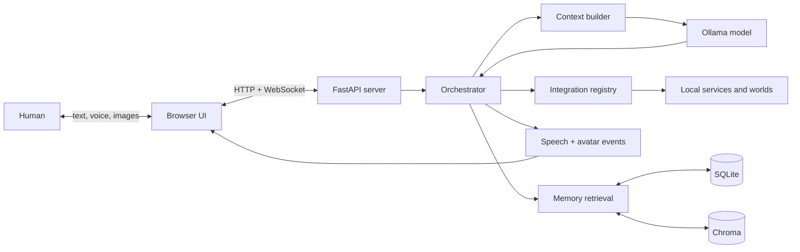

# Architecture overview

Astra is a local-first assistant runtime built around four long-lived concerns: **identity, memory, beliefs, and agency**. The architecture keeps those concerns explicit while allowing the model, avatar, integrations, and planning experiments to evolve independently.

## System map

The FastAPI server owns transport concerns. The orchestrator owns a turn. Stores own durable history and memory. Integrations expose validated capabilities. The browser renders the conversation, audio, and VRM avatar without deciding assistant behavior.

## Architectural boundaries

-   :material-access-point:{ .lg .middle } **Transport**

    ---

    `app/server.py` translates HTTP and WebSocket traffic into typed turn inputs and streams runtime events back to connected clients.

-   :material-transit-connection-variant:{ .lg .middle } **Orchestration**

    ---

    `app/core/orchestrator.py` coordinates retrieval, persistence, context, inference, tools, and finalization for one authoritative session.

-   :material-database-clock:{ .lg .middle } **Continuity**

    ---

    SQLite stores canonical records. Chroma provides semantic retrieval. Rolling summaries and bounded recent history reconstruct conversation context.

-   :material-puzzle-outline:{ .lg .middle } **Capabilities**

    ---

    Integrations register JSON-schema-validated actions and optional passive context. The model never directly executes implementation code.

## Core principles

### Explicit session authority

The active conversation is not mutable global state inside the orchestrator. Every user turn carries a `session_id`, sender attribution, input source, and durable session kind. Tool-sensitive flows receive a frozen authoritative turn context rather than trusting model-generated identity fields.

### Local model calls are stateless

Ollama does not retain Astra's conversational state. Every inference receives a reconstructed prompt containing the system role, relevant background context, a rolling summary, recent unsummarized messages, and the current input. This is why context construction is a critical persistence boundary.

### Canonical records before embeddings

SQLite is authoritative for chat history, attachments, summaries, memories, beliefs, and autonomy records. Vector collections are retrieval indexes, not the source of truth.

### Semantic actions over implementation details

The model selects capabilities such as an integration action, avatar expression, or outfit. Application code resolves those semantic choices into concrete files, services, and side effects.

## Follow a turn

The [runtime lifecycle](architecture/runtime.md) documents control flow from incoming message to final response. The [context construction](architecture/context-building.md) page explains exactly what the model sees and how a restored chat regains continuity.
