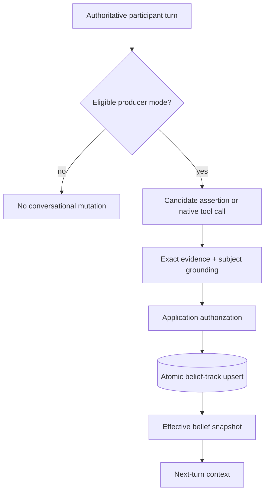

# Beliefs

Beliefs are revisable assertions owned by Astra. They are not raw memory, persona, goals, or passive integration state.

## Provenance model

Every belief track records:

- the owner whose epistemic state is represented;
- the subject the claim concerns;
- the sender who supplied the evidence;
- the originating session and message;
- visibility and expiry policy;
- deterministic epistemic status.

If a sender makes a claim about themselves, it is a `SELF_REPORT`. A claim about another entity is an `ATTRIBUTED_CLAIM`. Contradictory source tracks may coexist because Astra does not silently convert disagreement into false consensus.

## Processing modes

- `disabled` keeps storage and context available but creates no conversational beliefs.
- `observer` performs a post-response extraction pass.
- `react_tool` exposes `beliefs__update` to eligible participant turns in the main native tool loop.

Only one conversational producer is active at a time.

## Authority and safety

The application supplies owner, session, source message, sender identity, observation time, and subject IDs. Evidence excerpts must be exact substrings of the authoritative participant message. The model proposes content and policy within that boundary; it does not manufacture provenance.

Session-scoped beliefs are removed with their session. Agent-scoped beliefs survive session deletion and require an explicit forgetting operation.
