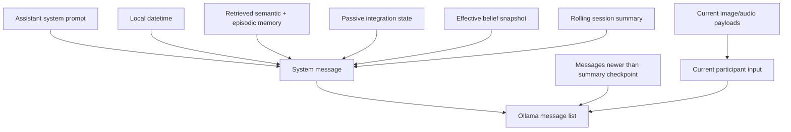

# Context construction

Ollama model calls are stateless. Astra must reconstruct continuity from durable application state for every inference—including the first turn after Ollama or the application restarts.

## Prompt composition



`ContextBuilder` assembles the message list in this order:

1. the assistant system prompt and current local datetime;
2. retrieved memory and passive integration state;
3. the effective belief snapshot;
4. the rolling session summary, when present;
5. bounded recent history;
6. the current participant message and current attachments.

## Summary checkpoint semantics

`SummaryStore` persists both the summary text and the message count through which it is authoritative. The builder asks `ChatHistoryStore` for the current count and keeps every newer message within the configured history bound.

```text
messages 1 ───────── 40 │ 41 ───────── 46 │ current
       covered by summary   unsummarized
```

The prompt contains the summary plus messages 41–46. This prevents recent turns from disappearing between periodic summary updates and makes a reopened session reconstruct the same conversational state.

## Historical images

Only media attached to the current turn is sent to Ollama as a binary multimodal payload. Replaying base64 for every recent historical image made prompts grow rapidly and increased timeouts.

Historical image turns are represented as text:

```text
[Earlier attached image: workspace.png. Image summary: A terminal showing a failed build.]
```

The original bytes remain available to the history UI, and the image summary remains indexed for episodic retrieval. If summarization failed, Astra still receives the filename without replaying the bytes.

!!! success "Stability invariant"
    The cost of a new text-only turn must not grow with the byte size of images attached to previous turns.

## Deduplication

The orchestrator persists the current user turn before building context. The builder therefore detects the stored copy by role, sender, content, and attachment identity, then includes only the authoritative current input with its live media payload.

## Group conversations

Manual group messages are rendered inside server-produced `PARTICIPANT_MESSAGE` JSON envelopes. Authoritative sender IDs and types stay separate from untrusted display names and content, preventing participant text from masquerading as system attribution.

## Configuration

`context.history_limit` bounds recent messages. `orchestrator.summary_trigger` controls how many new messages may accumulate before `TurnFinalizer` refreshes the rolling summary. Keep the history limit at least as large as the summary interval if every unsummarized message must always be available.
