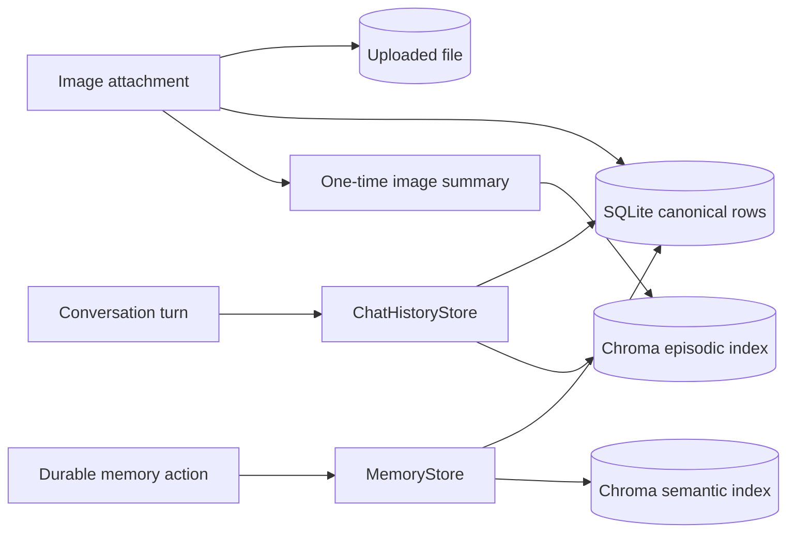

# Memory

Astra uses multiple forms of continuity because a chat transcript, a durable fact, and a revisable current claim have different lifecycles.

## Storage model

### Conversation history

`ChatHistoryStore` persists every message in SQLite, stores image metadata and files, and indexes retrieval-oriented text in the episodic collection. Session deletion removes its chat rows, attachment files, attachment metadata, and episodic entries.

### Long-term memory

`MemoryStore` holds event, decision, instruction, experience, and narrative information worth recalling later. It writes canonical rows to SQLite and embeddings to the semantic collection.

### Rolling summaries

`SummaryStore` keeps one evolving summary per session with a message-ID checkpoint. `TurnFinalizer` updates it after enough new messages accumulate. Context construction compares message IDs directly against this checkpoint. It reads the newest eligible user and assistant messages, excluding rows marked out of context, within the configured history limit. All newer messages in that window are retained, with up to two recent messages kept for continuity when the summary is current. If the unsummarized backlog exceeds the limit, the newest messages win; older backlog remains stored for subsequent summarization and the reader does not advance the checkpoint. Summaries without a checkpoint conservatively retain the full recent-history window.

## Retrieval during a turn

After the current user message is durably persisted, `MemoryRetriever` searches relevant long-term facts and episodic records from past sessions. Results are bounded and inserted into an explicitly untrusted background-context section of the system prompt.

Retrieval is relevance-based; it is not a replacement for the current session's summary and recent-history window.

## Memory versus beliefs

Use durable memory for things worth recalling as an event or narrative later. Use [beliefs](beliefs.md) for present, revisable claims about what is true. The same proposition normally should not be written to both systems.
