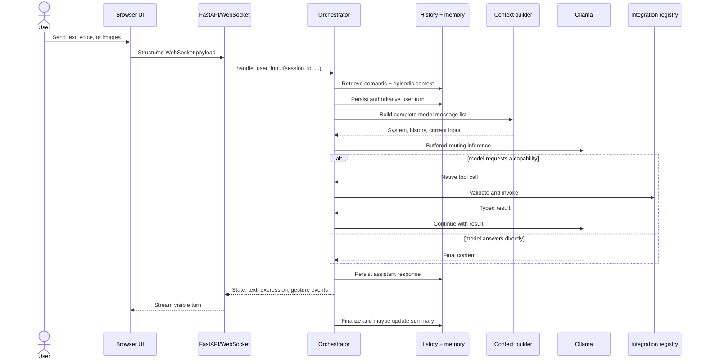

# Runtime lifecycle

A normal turn crosses transport, persistence, retrieval, model inference, optional capabilities, and presentation. The orchestrator coordinates those stages without owning the active session globally.

## User turn sequence

## Authoritative input

The server parses the client payload into a `TurnInput`. The orchestrator assigns trusted sender attribution and persists the user message before exposing turn-scoped tools. A frozen `AuthoritativeTurnContext` then anchors session, message, sender, observation time, input source, and timezone.

This ordering matters: model arguments may express an intended action, but they cannot invent the authority under which that action runs.

## Routing modes

=== "Agent turn"

    The normal late-routing path performs buffered inference with registered capability schemas. It permits one native tool call per inference step and bounds the number of steps. Tool results are added to the model conversation before the next step.

=== "Instant turn"

    Instant mode bypasses capability exposure and streams a direct response. It is useful when latency matters more than agent behavior.

=== "Autonomous event"

    Integration events run through a durable autonomy queue. Each event declares an exact capability allowlist, correlation lineage, and notification policy. Internal final text is journaled; only explicit notification actions interrupt the user.

## Presentation events

The model's visible response is processed into separate runtime events:

- thinking text;
- assistant speech text;
- state transitions;
- expressions and gestures;
- outfit changes;
- audio URLs;
- notices and approval requests.

The server translates those events into WebSocket payloads. The UI controls playback and rendering, while business decisions remain in the runtime.

## Failure boundaries

- Invalid client payloads fail before orchestration.
- Capability schemas are validated before invocation.
- A failed optional context provider does not stop the turn.
- Empty model output is replaced with a deterministic visible fallback.
- The runtime returns the assistant to an idle state even when inference fails.
- User-visible tool side effects may require explicit approval.
