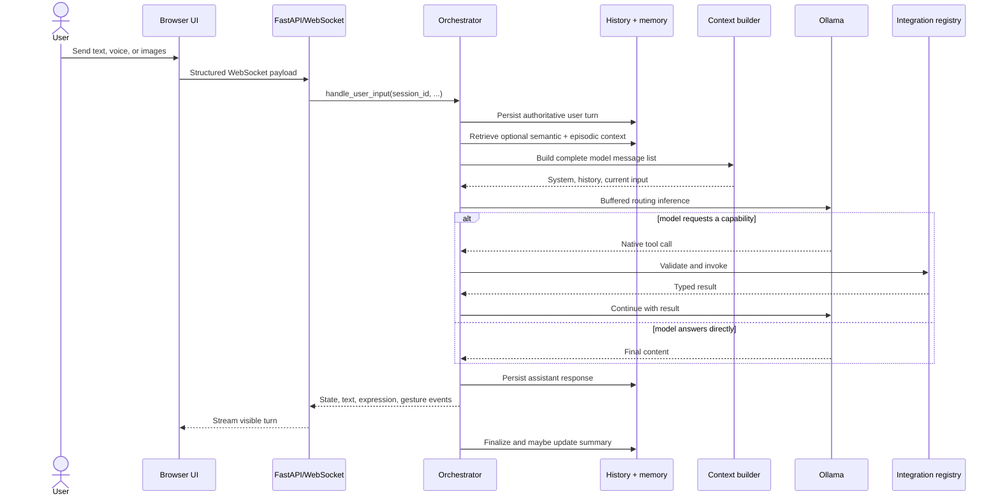

# Runtime lifecycle

A normal turn crosses transport, persistence, retrieval, model inference, optional capabilities, and presentation. The orchestrator coordinates those stages without owning the active session globally.

## User turn sequence

## Authoritative input

The server parses the client payload into a `TurnInput`. The orchestrator assigns trusted sender attribution and persists the user message before exposing turn-scoped tools. A frozen `AuthoritativeTurnContext` then anchors session, message, sender, observation time, input source, and timezone.

This ordering matters: model arguments may express an intended action, but they cannot invent the authority under which that action runs.

## Routing modes

=== "Agent turn"

    The normal late-routing path performs buffered inference with registered capability schemas. It permits one native tool call per inference step and bounds the number of steps. Tool results are added to the model conversation before the next step.

=== "Instant turn"

    Instant mode bypasses capability exposure and streams a direct response. It is useful when latency matters more than agent behavior.

=== "Autonomous event"

    Integration events run through a durable autonomy queue. Each event declares an exact capability allowlist, correlation lineage, and notification policy. Internal final text is journaled; only explicit notification actions interrupt the user.

## Operation outcomes

The operation journal accepts `running → pending` and `running/pending → success/error/denied/unavailable/cancelled`. Terminal outcomes are final. Identical status/result retries leave the record and timestamps unchanged; contradictory results, including late pending acknowledgements, are retained in `integration_operation_conflicts` and available through `operation_conflicts()`. Acceptance and conflict recording are transactional across store connections.

Beginning the same invocation again preserves its state. Reusing an ID with different capability, session, or lineage raises an error. Invalid result statuses are rejected; unknown external operation IDs remain a no-op. Session deletion cancels active operations and subsequent completions cannot revive them. Corrections require a new operation; there is no implicit terminal-state override.

## Presentation events

The model's visible response is processed into separate runtime events:

- thinking text;
- assistant speech text;
- state transitions;
- expressions and gestures;
- outfit changes;
- audio URLs;
- notices and approval requests.

The server translates those events into WebSocket payloads. The UI controls playback and rendering, while business decisions remain in the runtime.

## Failure boundaries

- Invalid client payloads fail before orchestration.
- Capability authority is checked at dispatch, independently of schema exposure.
  An empty permitted set denies all tools; event calls missing explicit authority
  also deny all tools. Participant/internal calls may use unrestricted application
  authority. Allowed calls still pass schema, availability, approval, and domain checks.
- A failed optional context provider does not stop the turn.
- User input is durable before retrieval; semantic and episodic query failures are
  isolated independently, preserving successful context from the other provider.
- Empty model output is replaced with a deterministic visible fallback.
- The runtime returns the assistant to an idle state even when inference fails.
- User-visible tool side effects may require explicit approval.

## Speech delivery deadlines

Text chunks and `assistant_end` no longer wait for speech synthesis. Audio may arrive
before or after text completion; the browser maintains its own playback queue.
Autonomous speech notifications follow the same text-first ordering.

Each synthesis caller has a 30-second deadline covering queue admission and completion.
The serial backend call also has a 30-second deadline. GPT-SoVITS additionally uses
5-second connection and 20-second read timeouts. A turn can queue eight pending speech
fragments; saturation or synthesis failure drops remaining optional speech while text
continues. After text generation ends, speech drains for at most 30 seconds before its
consumer is cancelled. Turn ownership is retained during that bounded drain to avoid
misattributing late audio to another turn. Application audio shutdown drains for at most
five seconds, then rejects remaining jobs.

An in-process engine cannot be forcibly interrupted by cancelling an async wait.
If its execution deadline expires, speech is disabled until application restart;
subsequent calls fail promptly instead of starting overlapping synthesis. At most one
abandoned daemon synthesis thread remains per audio owner, and late output is removed.
It does not participate in Python's default-executor shutdown. This bounds waiting and
normal shutdown, but cannot recover native code that holds the interpreter lock or
release a stuck engine's memory before process exit. Hard termination and automatic
backend recovery would require process isolation.
