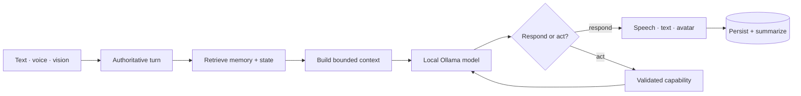

<section class="astra-hero" markdown>

LOCAL-FIRST · EMBODIED · EXTENSIBLE

# Meet the system behind Astra

Astra is a modular AI assistant that combines a local language model, durable conversational continuity, revisable beliefs, validated tools, autonomous integrations, voice, and a live VRM avatar.

[Explore the architecture](architecture.md){ .md-button .md-button--primary }
[Open the project map](project-map.md){ .md-button }

<figure class="astra-site-illustration astra-site-illustration--hero">
  
  <figcaption>Hello, future me. Here is where we left everything.</figcaption>
</figure>

</section>

**Current focus** · Milestone 0 — documentation and stabilization

## Four foundations

-   :material-account-circle-outline:{ .lg .middle } **Identity**

    ---

    Authoritative participants, assistant ownership, session scopes, and future formal persona architecture.

-   :material-brain:{ .lg .middle } **Memory**

    ---

    Canonical history, rolling summaries, semantic facts, episodic retrieval, and image summaries.

-   :material-thought-bubble-outline:{ .lg .middle } **Beliefs**

    ---

    Revisable, provenance-aware claims that preserve who said what without forcing false consensus.

-   :material-robot-industrial-outline:{ .lg .middle } **Agency**

    ---

    Schema-validated capabilities, bounded tool loops, event-driven autonomy, and experimental worlds such as Mindcraft.

## What exists today

Astra currently includes a FastAPI/WebSocket runtime, native model tool routing, SQLite and Chroma-backed continuity, sender-aware group conversations, structured beliefs, voice input and speech, avatar controls, autonomous event handling, web and shell capabilities, and Mindcraft integration.

!!! note "Research project, real architecture"
    Astra is intentionally a hobby and research project. Experimental features are welcome, but the system aims to make their boundaries, risks, and dependencies understandable.

## Start reading

- New to the repository? Begin with [Getting started](getting-started.md).
- Lost in the code? Use the [Project map](project-map.md) or [Where do I change...?](guides/where-to-change.md).
- Connecting a local dependency? Open the [Service catalog](services/index.md).
- Changing turn behavior? Read the [Runtime lifecycle](architecture/runtime.md).
- Working on continuity or multimodal prompts? Read [Context construction](architecture/context-building.md).
