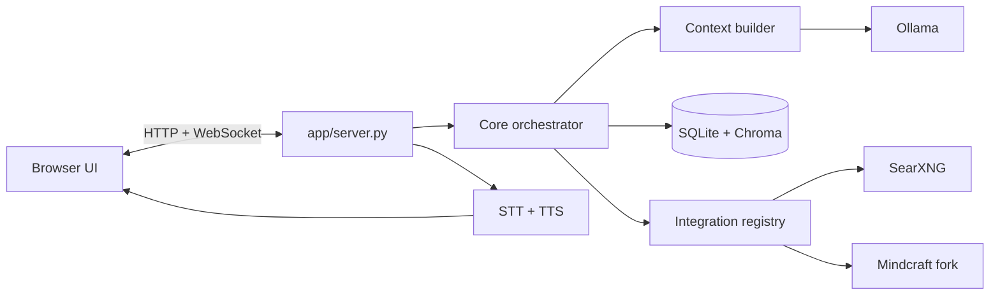

# Project map

Use this page when you know the part of Astra you want to understand, but not yet where it lives. For a direct task-to-file lookup, jump to [Where do I change...?](guides/where-to-change.md).

## Runtime at a glance

The browser and server own transport. The orchestrator owns a turn. Context construction decides what the model sees. Integrations expose bounded capabilities and passive state. SQLite remains the canonical record; Chroma supports semantic retrieval.

## Source areas

| Area | Responsibility | Start here |
| --- | --- | --- |
| `app/server.py` | FastAPI routes, WebSockets, browser sessions, audio, static files | A request or browser event enters here |
| `app/transport/` | WebSocket frame contracts, connection state, and approval waits | `websocket_protocol.py`, `websocket_connection.py` |
| `app/core/` | Turn lifecycle, context assembly, capability execution, completion | `orchestrator.py`, `context_builder.py`, `turn_finalizer.py` |
| `app/avatar/` | Avatar control catalogs, prompts, and streamed control parsing | `controls.py`, `stream_processor.py` |
| `app/llm/` | Ollama streaming and model-output normalization | `ollama_stream.py`, `thinking_filter.py` |
| `app/memory/` | Chat history, summaries, retrieval, reflection, and semantic memory | `chat_history.py`, `retriever.py`, `reflector.py` |
| `app/storage/` | SQLite and vector-store infrastructure | `database.py`, `vector_store.py` |
| `app/perception/` | Attachments, perceived state, frame handling, and visual inference | `attachments.py`, `frame_controller.py`, `vision_watchdog.py` |
| `app/beliefs/` | Structured, revisable, provenance-aware beliefs | `service.py`, `repository.py`, `models.py` |
| `app/knowledge/` | Read-side knowledge views used by the UI | `service.py`, `models.py` |
| `app/integrations/` | Capability registration, external state, Mindcraft | `registry.py`, `runtime.py`, `mindcraft.py` |
| `app/autonomy/` | Event queues, bounded autonomous work, persistence | `runtime.py`, `coordinator.py`, `store.py` |
| `app/tools/` | Shell and web-search implementations and backend result processing | `bash_execution.py`, `web_search.py` |
| `app/stt/`, `app/tts/` | Speech recognition and speech synthesis engines | Each folder's `factory.py` |
| `static/` | Browser application, styles, avatar assets, generated media | Start with the browser entry script and HTML |
| `tests/` | Python and browser-side regression tests | Find the test named after the subsystem |
| `docs/` | This generated documentation | `mkdocs.yml` controls navigation |

## Dependency direction

- `app/server.py` adapts HTTP and WebSocket transport into core and feature calls.
- `app/transport/` owns wire and live-connection concerns; feature packages must not
  depend on transport models or WebSocket objects.
- `app/core/` coordinates a turn using feature contracts but does not own storage,
  model backends, transport, or external integrations.
- Feature packages (`memory`, `perception`, `avatar`, `beliefs`, and `knowledge`) own
  their domain-specific models and workflows.
- `app/integrations/` owns model-visible capability and event contracts; `app/tools/`
  owns concrete backend operations.
- `app/storage/`, `app/llm/`, `app/stt/`, and `app/tts/` isolate infrastructure and
  backend-specific behavior.

## Configuration map

The committed reference is `app/config/assistant-template.yaml`. Your machine-specific configuration is `app/config/assistant.yaml` and is intentionally ignored.

Configuration is validated at startup. Unknown keys, coercive scalar types, invalid
ranges, malformed identity values, and unsupported LLM endpoints fail with a field-level
error instead of being silently ignored.

| Configuration section | Controls |
| --- | --- |
| `llm` | Ollama endpoint, model, timeout, retries, generation settings |
| `context` | Recent history, retrieved memory, and integration context limits |
| `orchestrator` | Summary trigger and turn-level behavior |
| `beliefs` | Belief extraction mode, limits, expiry, and model budget |
| `autonomy` | Event processing, tool-step limits, queue size, concurrency |
| `tts`, `stt`, `voice_input` | Spoken input and output paths |
| `integrations` | Web, memory, shell, and Mindcraft capabilities |
| `logging` | Runtime and trace log destinations and rotation |

## Runtime data

| Data | Storage | Authority |
| --- | --- | --- |
| Conversations, messages, summaries, attachment metadata | SQLite | Canonical |
| Semantic and episodic retrieval indexes | Chroma | Derived, searchable index |
| Uploaded and generated media | `static/` subdirectories | File referenced by canonical metadata |
| Local behavior and endpoints | `app/config/assistant.yaml` | Machine-local configuration |
| Logs and traces | `logs/` | Diagnostic output |

## Current development shape

| Capability | State | Notes |
| --- | --- | --- |
| Text and multimodal turns | Active | Local Ollama-backed runtime |
| Persistent conversation continuity | Active, stabilizing | SQLite history, summaries, and semantic retrieval |
| Structured beliefs | Experimental | Observer and tool-react processing modes |
| Voice input and output | Active | Selectable STT and TTS engines |
| Autonomous events | Experimental, disabled by default | Explicit queue and chain limits |
| Mindcraft | Experimental, disabled by default | External or hybrid controller modes |

!!! tip "The shortest route"
    If you are about to search the whole repository, check [Where do I change...?](guides/where-to-change.md) first. It maps common intentions to configuration, implementation, tests, and supporting documentation.
