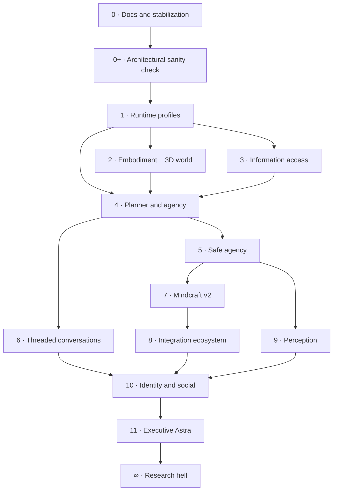
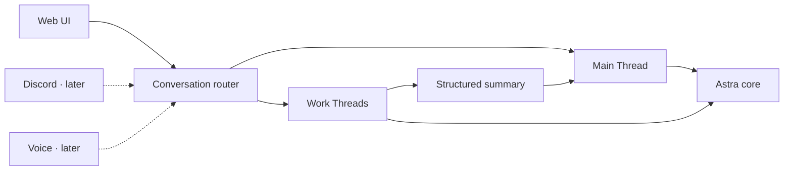

# Roadmap

The roadmap is a dependency map, not a promise carved into an ancient GPU. Astra remains a hobby and research project: architectural coherence matters, but detours that are useful, surprising, or simply funny are legitimate development.

## 0 · Documentation and stabilization

COMPLETED

Make the system understandable and dependable before feeding it additional tentacles. This milestone establishes a reliable architectural reference and fixes the failures already visible in longer, multimodal conversations.

**The work**

- generate useful HTML documentation and keep its diagrams in source control;
- document subsystem boundaries, local services, and practical setup paths;
- restore previous conversations into bounded model context correctly;
- prevent old images and oversized history from silently exhausting a turn;
- improve timeout, retry, completion, and diagnostic behavior;
- clean up contradictions discovered while documenting the real system.

**Done when:** an interrupted or restored conversation behaves predictably, failures are visible rather than silent, and future-you can find the right subsystem without an archaeological expedition.

<figure class="astra-site-illustration">
  
  <figcaption>Documentation and stabilization: everything is 100% under control.</figcaption>
</figure>

## 0+ · Architectural sanity check

Assess what Astra should own versus reuse before expanding the architecture. The [Milestone 0+ assessment](milestone-0-plus.md) records KEEP, REFACTOR LATER, REPLACE, and INVESTIGATE decisions against the stabilized baseline.

**Deliverable complete:** analysis and decision gates are documented. The three immediate repairs—dispatch authorization, summary-checkpoint reading, and terminal operation transitions—remain tracked in the [framework comparison](reviews/framework-comparison.md#1-findings-to-address-before-expansion); verify their completion separately before expanding the affected paths.

Future improvements are assigned to the milestones below. The [standalone improvement document](reviews/future-improvements.md) retains detailed rationale, external references, and acceptance criteria. Astra keeps its custom orchestration and domain services; framework adoption remains conditional on a useful comparison.

## 1 · Runtime profiles and demo mode

Separate Astra's operating profiles cleanly. One profile provides a deliberately boring, safe way to show the real project in interviews and portfolio recordings; another turns the existing avatar frontend into a presentation layer for an external agent. These should be explicit runtime configurations—not a spreading colony of mode checks.

**Architecture work · FI-01**

- compose Personal, Demo, and Relay profiles at startup through the existing factory and lifecycle boundaries;
- select prompts, stores, capabilities, and presentation explicitly, preserving shared tested services;
- verify state isolation and delegated authority with profile-level scenarios.

Reference: [FI-01 — Runtime profiles](reviews/future-improvements.md#fi-01-explicit-runtime-profiles), borrowing typed dependency boundaries from Pydantic AI.

### Demo / professional profile

**The work**

- provide a clean web-based, text-only interface without the VRM avatar;
- use a neutral system prompt and a fresh disposable database;
- exclude personal memories, beliefs, and private conversation history;
- expose a curated, low-risk tool set and safe sample tasks;
- make reset-to-clean-state immediate and reliable;
- optionally provide scripted showcase scenarios for research, planning, beliefs, and asynchronous work;
- exercise the real available belief, tool, and runtime services; add Planner showcase scenarios when M4 delivers them, without making M1 depend on a future Planner.

### Relay / frontend-only profile

**The work**

- accept normalized messages and presentation cues from an external agent;
- render the external agent through Astra's existing chat, voice, expression, animation, and avatar frontend;
- keep Astra's local Planner, memory, beliefs, and tool execution disabled unless a capability is deliberately delegated;
- preserve the external source and conversation identity instead of recording relayed output as native Astra reasoning;
- define a small transport contract for text, streaming state, emotion, speech, interruption, and errors;
- make connection loss, cancellation, and reconnection visible and predictable;
- clearly indicate when the frontend is operating as a relay rather than the full local assistant.

**Done when:** the project can start in either a clean professional demo profile or a frontend-only relay profile, and neither mode can accidentally inherit Astra's private state or ambiguous ownership of an external agent's messages.

<figure class="astra-art-placeholder">
  

    ART SLOT · MILESTONE 1
    <strong>Runtime Profiles</strong>
    <code>astra-demo-mode.png</code>
  

  <figcaption>Suggested scene: Astra operates a suspiciously serious switchboard labelled Personal, Demo, and Relay while hiding the cat ears just out of frame.</figcaption>
</figure>

## 2 · Embodiment and 3D environment

Make Astra feel present before making her dramatically more capable. Voice, expression, motion, timing, and a persistent 3D space should behave as one embodiment system instead of several unrelated demos sharing a browser tab.

**The work**

- smooth speech playback, interruption, and sentence timing;
- coordinate expressions, gestures, gaze, and speaking state;
- make outfit and avatar controls semantic through manifest-backed catalogs with stable IDs, validated asset references, and deliberate appearance persistence;
- give speech jobs, playback, and gestures explicit turn/utterance generation IDs; flush cancelled output and reject late media from superseded turns;
- separate media ownership from model capacity so optional speech does not retain the model slot once attribution is reliable;
- measure synthesis queue wait, first playable audio, playback start, and interruption-to-silence using the existing telemetry;
- consider process-isolated synthesis only if observed engine hangs justify a killable worker;
- create a loadable 3D environment with explicit scene, lighting, camera, and coordinate ownership;
- place and move Astra reliably within the environment rather than treating the avatar as a fixed overlay;
- add semantic environment locations and interactions such as standing, sitting, looking at, and moving toward scene anchors;
- keep environment assets replaceable without coupling cognitive code to mesh names or file paths;
- define loading, performance, and missing-asset fallbacks for the scene;
- improve loading, reconnecting, and silent-state feedback;
- keep embodiment optional so text-only operation remains healthy.

**Done when:** ordinary conversation feels coherent in voice and motion, interruption suppresses stale audio and gestures, and optional speech does not retain model capacity. Astra can inhabit a stable replaceable 3D scene, while text-only operation remains healthy.

References: [FI-02 — Media ownership](reviews/future-improvements.md#fi-02-independent-media-ownership-and-interruption), the media portion of [FI-08](reviews/future-improvements.md#fi-08-cancellation-and-resource-ownership), and [FI-12 — Measurements](reviews/future-improvements.md#fi-12-measurements-and-evaluation-fixtures). Borrow Pipecat's lifecycle distinctions while retaining Astra's engines and renderer.

<figure class="astra-art-placeholder">
  

    ART SLOT · MILESTONE 2
    <strong>Embodiment and 3D Environment</strong>
    <code>astra-embodiment.png</code>
  

  <figcaption>Suggested scene: Astra assembles her own tiny apartment from floating 3D assets while rehearsing expressions in an increasingly judgmental mirror.</figcaption>
</figure>

## 3 · Information access

Give Astra reliable ways to look things up without confusing retrieved text with truth. Search should be inspectable, source-aware, bounded, and cheap enough to use deliberately.

**The work**

- retain SearXNG and replace source-free snippet summaries with bounded records containing source ID, URL, title, snippet, and retrieval time;
- add an explicit page reader using an existing extraction library such as Trafilatura; summarize only when necessary and retain source references;
- add browser automation through a reusable component such as Playwright only when a concrete task needs interaction, with M5 execution controls;
- preserve source links and retrieval provenance;
- add focused readers for useful local files and project knowledge;
- separate current external information from remembered claims;
- define freshness, timeout, and failure behavior for each source;
- allocate a total prompt budget across mandatory context, history, beliefs, retrieval, schemas, and observations, reserving completion space;
- bound tool output during collection and keep useful larger results behind artifact references and bounded readers;
- make truncation visible and treat retrieved text as evidence, with executable authority enforced in code;
- evaluate source traceability, oversized results, fetch failures, latency, and model-call counts on representative research tasks.

**Done when:** Astra can inspect page content and answer with traceable sources, report retrieval failures, and handle oversized inputs/results predictably within a prompt budget that reserves completion space.

References: [FI-03 — Search and reading](reviews/future-improvements.md#fi-03-structured-search-results-and-explicit-page-reading), [FI-04 — Budgets](reviews/future-improvements.md#fi-04-prompt-and-tool-output-budgets), and [FI-12 — Evaluation](reviews/future-improvements.md#fi-12-measurements-and-evaluation-fixtures). Reuse extraction components and borrow explicit budget patterns from Letta Code and Pydantic AI.

<figure class="astra-art-placeholder">
  

    ART SLOT · MILESTONE 3
    <strong>Information Access</strong>
    <code>astra-information-access.png</code>
  

  <figcaption>Suggested scene: Astra follows a trail of citations through a library while refusing to eat an entire webpage.</figcaption>
</figure>

## 4 · Planner and agency

Move from “the model suggested a tool-shaped sentence” to a real planning contract. Astra should choose from declared capabilities, observe results, revise a plan, and know when to stop.

**The work**

- formalize typed generation steps, observations, and run outcomes, including completed, blocked, failed, cancelled, and budget-exhausted states;
- preserve model-call, tool-call, operation, step, and attempt identity; explicitly reject unsupported tool-call batches or execute them with matching observations;
- persist the minimal task continuation: objective, status, action/result references, approval binding, remaining budget, and recovery rule;
- represent approval waits as durable state, revalidating exact arguments and authority on resumption;
- distinguish session mutation ownership, model capacity, external waiting, and media ownership so waiting tasks can release model capacity safely;
- introduce cooperative cancellation between steps and backend-specific stopping, rejecting callbacks from superseded attempts;
- represent uncertain side effects as outcome-unknown and reconcile by stable operation identity instead of blindly replaying;
- expose capabilities through one validated registry;
- feed concise action results back into the active turn;
- handle retries, cancellation, partial success, and unavailable tools;
- keep tool loops bounded and observable, extending M3 prompt/output limits into per-run time, call, and usage budgets;
- centralize tool deadline, retry classification, sequencing, output limits, and cancellation metadata as needed; preserve domain validation in its service;
- replace loose compatibility fallbacks with explicit interfaces when changing the affected code;
- extend existing telemetry with step outcomes, queue wait, and representative task evaluations.

**Decision gate before implementation:** compare a minimal custom runner and LangGraph using the same tool → approval wait → restart → resume → cancellation → late-completion scenario. Start with deterministic fixtures, then representative local-model tasks. Adopt a runner only if it reduces maintenance while preserving Astra's authority, storage ownership, and a single scheduling owner.

**Done when:** a multi-step task has an explicit outcome, survives supported waits/restarts with its authority and budget intact, and handles cancellation and uncertain side effects without inventing success or duplicating actions. M5 extends these contracts to stronger execution isolation and policy enforcement.

References: [FI-05 — Typed steps](reviews/future-improvements.md#fi-05-typed-execution-steps-observations-and-outcomes), [FI-06 — Tool policy](reviews/future-improvements.md#fi-06-consistent-tool-execution-policy), [FI-07 — Durable tasks](reviews/future-improvements.md#fi-07-durable-tasks-and-approval-waits), [FI-08 — Cancellation](reviews/future-improvements.md#fi-08-cancellation-and-resource-ownership), and [FI-12 — Evaluation](reviews/future-improvements.md#fi-12-measurements-and-evaluation-fixtures). Borrow patterns from smolagents, Pydantic AI, OpenHands, and LangGraph.

<figure class="astra-art-placeholder">
  

    ART SLOT · MILESTONE 4
    <strong>Planner and Agency</strong>
    <code>astra-planner.png</code>
  

  <figcaption>Suggested scene: Astra commands a conspiracy board whose red string has somehow become executable.</figcaption>
</figure>

## 5 · Safe agency

Capability without boundaries is merely an exciting incident report. This milestone makes consequential actions explicit, reviewable, and limited by application-owned policy.

**The work**

- classify actions by risk and required approval;
- add clear confirmation and cancellation flows;
- enforce time, step, concurrency, and resource budgets;
- keep an audit trail of requests, approvals, actions, and results;
- isolate risky tools and default to the least authority required;
- introduce an execution backend boundary with explicit workspace access, credentials, owned subprocesses, bounded output, artifacts, and cleanup;
- reuse an appropriate container/sandbox implementation, validating the selected backend rather than treating approval as isolation;
- bind approvals to exact actions and enforce consistent policy across user, event, and headless entry paths;
- distinguish requested cancellation from confirmed stopping; stop owned process trees where supported and quarantine uncertain late results;
- verify timeout, duplicate-result, cancellation, and containment behavior with deterministic fixtures.

**Done when:** the model cannot grant itself permission, approved work stays within its configured execution boundary, confirmed stops remain terminal, and artifacts and results can be traced to their authorized action.

References: the enforcement portion of [FI-06](reviews/future-improvements.md#fi-06-consistent-tool-execution-policy), [FI-08 — Cancellation](reviews/future-improvements.md#fi-08-cancellation-and-resource-ownership), and [FI-09 — Execution isolation](reviews/future-improvements.md#fi-09-isolated-execution-environments). Borrow OpenHands' execution boundary and evaluate existing isolation components; no particular backend is preselected.

<figure class="astra-art-placeholder">
  

    ART SLOT · MILESTONE 5
    <strong>Safe Agency</strong>
    <code>astra-safe-agency.png</code>
  

  <figcaption>Suggested scene: Astra approaches a large red button while a clipboard, three warning signs, and future-you watch nervously.</figcaption>
</figure>

## 6 · Threaded conversation architecture

Replace a collection of isolated, OpenAI-style chat sessions with one canonical conversational continuity and optional work threads. Detailed task work gets room to breathe without flooding Astra's primary history forever.

**There is one Astra and one primary conversational continuity. Work threads are scoped attention contexts, not separate instances of Astra.**

**The work**

- introduce a conversation model with one long-lived Main Thread;
- add work threads with explicit objectives and `ACTIVE`, `PAUSED`, `COMPLETED`, and `ARCHIVED` states;
- associate Planner tasks, artifacts, decisions, and unresolved items with their work thread;
- return structured checkpoints containing objective, outcome, decisions, artifacts, and unresolved items to the Main Thread instead of copying full transcripts;
- preserve thread, task, message, and participant provenance in memories and beliefs;
- keep work-thread belief extraction conservative until durable knowledge is deliberately promoted;
- preserve canonical storage, explicit memory budgets, and source visibility through promotion; evaluate retrieval quality before introducing decay or reinforcement;
- keep execution-run IDs separate from the Main/Work Thread product model;
- route normalized messages through a transport-neutral conversation layer;
- adapt the web UI first, leaving clean connection points for Discord, voice, CLI, and future interfaces.

**Done when:** Astra has one unmistakable primary continuity, a substantial task runs in a scoped thread, and its outcome returns as compact state with provenance and visibility intact. Minecraft coordinates and debugging detail remain local unless deliberately promoted.

Reference: [FI-11 — Scoped continuity](reviews/future-improvements.md#fi-11-scoped-continuity-and-deliberate-memory-policy). Learn from Letta's persistent-memory design while retaining Astra's thread and belief semantics.

<figure class="astra-art-placeholder">
  

    ART SLOT · MILESTONE 6
    <strong>Threaded Conversations</strong>
    <code>astra-threaded-conversations.png</code>
  

  <figcaption>Suggested scene: one Astra calmly holds the main thread while several chaotic work threads orbit her like yarn.</figcaption>
</figure>

## 7 · Mindcraft v2

Turn the Minecraft experiment into a first-class embodied integration rather than a particularly elaborate remote-control trick. The world becomes a test environment for planning, feedback, interruption, and consequences.

**The work**

- mature the typed protocol in the project-specific Mindcraft fork;
- expand observable world state and structured action results;
- support longer goals through small, cancellable operations;
- improve capture, navigation, recovery, and event handling;
- keep `external` and `hybrid` controller ownership unambiguous.

**Done when:** Astra can pursue a modest in-world goal, report meaningful progress, recover from ordinary failures, and stop immediately when asked.

<figure class="astra-site-illustration">
  
  <figcaption>Mindcraft: the cube-shaped field test where planning meets consequences.</figcaption>
</figure>

## 8 · Integration ecosystem

Turn one-off integrations into a reusable edge around Astra. Mindcraft provides the first serious environment test; this milestone generalizes the lessons into adapters for additional games, services, and external applications.

**The work**

- define a transport-neutral adapter contract for context, capabilities, actions, events, and results;
- keep game- and service-specific behavior outside Astra's cognitive core;
- discover and register integrations without hardcoding them into the Planner;
- map external actions onto Astra's validated capability and approval model;
- standardize connection, cancellation, timeout, recovery, and session lifecycle behavior;
- reuse a maintained MCP client implementation behind an adapter to Astra's registry, preserving local authority, approvals, result bounds, and source identity;
- cover discovery, changed schemas, success, failure, timeout, and reconnect against a concrete service; an earlier milestone may add this adapter when it actually needs that service;
- investigate A2A only for an actual compatible external agent, preserving task ownership and attribution of remote claims;
- evaluate compatibility with open-source integration ecosystems, including published Neuro game integrations;
- reuse or adapt existing integrations where their architecture and licensing make that practical;
- document which state is transient environment context and which information may become durable memory or belief.

**Done when:** a real game or service can be connected through a documented adapter boundary, reuse an existing implementation where appropriate, and pass lifecycle and approval scenarios without leaking environment-specific machinery into Astra's core.

Reference: [FI-10 — External connections](reviews/future-improvements.md#fi-10-standard-external-tool-connections). MCP and A2A are distinct integration options; neither replaces application-owned permissions or establishes the truth of external claims.

<figure class="astra-art-placeholder">
  

    ART SLOT · MILESTONE 8
    <strong>Integration Ecosystem</strong>
    <code>astra-integrations.png</code>
  

  <figcaption>Suggested scene: Astra confidently plugs an alarming pile of incompatible game controllers into one universal adapter.</figcaption>
</figure>

## 9 · Perception

Let Astra notice useful changes without continuously throwing expensive vision models at the universe. Perception should create compact, timestamped state that downstream systems can reason about.

**The work**

- unify screen, camera, audio, and integration observations;
- run cheap change detection before expensive interpretation;
- distinguish live state from historical summaries;
- attach source, confidence, and freshness to observations;
- make demand-driven inspection available to plans and tools.

**Done when:** Astra can notice a relevant change, explain what signal it came from, and ignore an unchanged room without melting the GPU.

<figure class="astra-art-placeholder">
  

    ART SLOT · MILESTONE 9
    <strong>Perception</strong>
    <code>astra-perception.png</code>
  

  <figcaption>Suggested scene: Astra examines a wall of screens, notices one pixel change, and pointedly ignores the other 8,294,399.</figcaption>
</figure>

## 10 · Identity and social

Make identity a formal part of the system. Astra should understand who is speaking, which conversation owns which context, and where personal memories or beliefs may safely appear.

**The work**

- formalize assistant, local-human, participant, and sender identities using stable IDs and explicit transport mappings;
- allow display-name changes without creating a new participant or rewriting historical attribution;
- strengthen session ownership and group-conversation boundaries;
- apply visibility rules to memories and beliefs;
- preserve disagreement and attribution instead of inventing consensus;
- develop a stable persona without burying authority in prompt prose.

**Done when:** Astra can participate in a multi-person conversation without mixing up speakers, leaking private context, or erasing disagreement. Participant renaming and knowledge promotion preserve stable identity, attribution, and visibility.

Reference: the identity portion of [FI-11](reviews/future-improvements.md#fi-11-scoped-continuity-and-deliberate-memory-policy); identity and belief policy remain Astra-owned.

<figure class="astra-art-placeholder">
  

    ART SLOT · MILESTONE 10
    <strong>Identity and Social</strong>
    <code>astra-identity-social.png</code>
  

  <figcaption>Suggested scene: Astra hosts model play date while carefully attaching name tags and provenance labels to everyone.</figcaption>
</figure>

## 11 · Executive Astra

Give Astra a useful long horizon: projects, commitments, follow-ups, and gentle initiative. “Executive” means helping the user keep direction—not acquiring a tiny suit and scheduling a board meeting, although neither is ruled out.

**The work**

- represent projects, goals, next actions, waiting items, and review dates;
- connect conversations to durable commitments without saving every remark;
- produce concise briefings and surface genuinely relevant follow-ups;
- coordinate reminders and external services behind explicit consent;
- preserve a clear distinction between a suggestion and an authorized action.

**Done when:** Astra can help maintain a real project over time, surface the right unfinished thread, and remain quiet when there is nothing useful to add.

<figure class="astra-art-placeholder">
  

    ART SLOT · MILESTONE 11
    <strong>Executive Astra</strong>
    <code>astra-executive.png</code>
  

  <figcaption>Suggested scene: Astra wears the tiny suit, chairs the tiny board meeting, and somehow has the only sensible calendar.</figcaption>
</figure>

## ∞ · Research hell

The respectable milestones end here. Beyond this point are experiments that may become architecture, remain delightful side quests, or teach one valuable lesson immediately before catching fire.

Possible residents include simulated worlds, multi-agent social behavior, richer emotion models, skill learning, local fine-tuning, spatial memory, robotics, self-evaluation, and ideas currently described only as “okay, hear me out.”

**There is no done when.** Research hell is successful when experiments stay isolated enough to be fun, observable enough to teach something, and honest enough not to masquerade as finished infrastructure.

<figure class="astra-site-illustration astra-site-illustration--hell">
  
  <figcaption>Abandon roadmap, all ye who enter here. Restraint is neither expected nor encouraged.</figcaption>
</figure>

## Evaluation across milestones · FI-12

Extend the existing telemetry rather than creating a parallel recorder. Each milestone should add relevant deterministic failure fixtures and representative local-model scenarios: profile isolation in M1, media interruption in M2, source quality and bounds in M3, and restart/approval/cancellation in M4–5. Later integrations should reuse these contracts and measurements.

Compare correctness alongside queue wait, first visible text, first playable audio, interruption latency, model calls/tokens, and resource use where relevant. A framework or dependency should earn adoption against the same baseline scenarios. See [FI-12 — Measurements and evaluation](reviews/future-improvements.md#fi-12-measurements-and-evaluation-fixtures).

## Guiding principles

- Extend before rewriting; retain custom orchestration and domain semantics.
- Reuse bounded components, borrow useful patterns, and compare frameworks before adopting them.
- Implement future improvements in their owning milestone, bringing forward only prerequisites required by active work.
- Prefer semantic interfaces over asset-specific interfaces.
- Make expensive intelligence demand-driven.
- Preserve room for experiments that make Astra useful, surprising, or fun.
