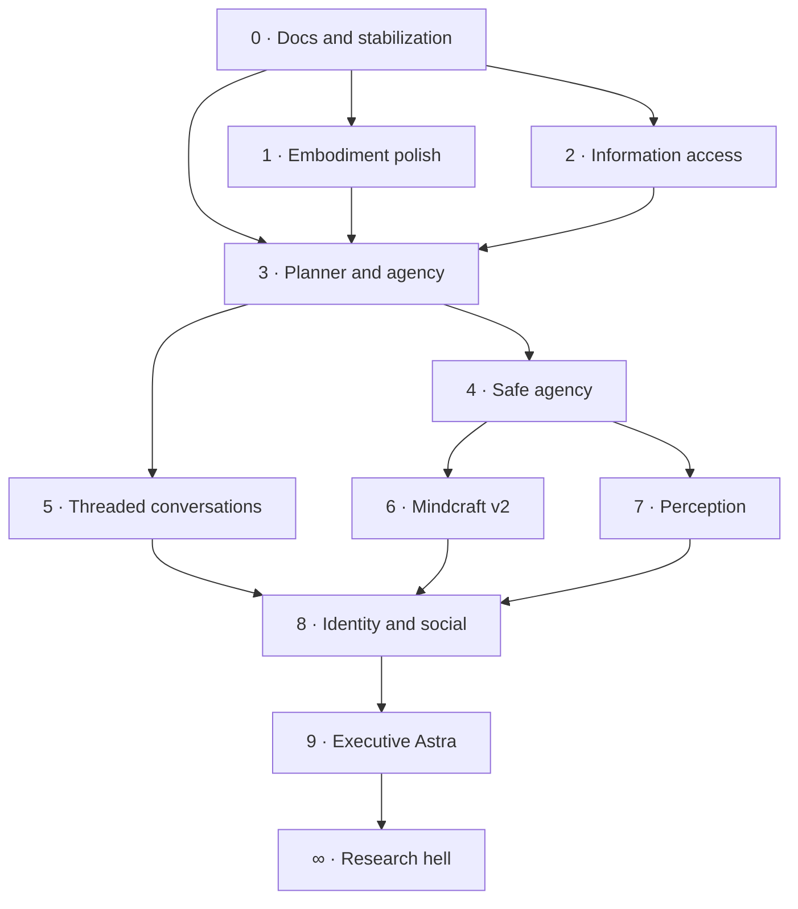
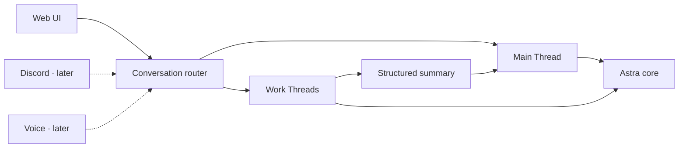

# Roadmap

The roadmap is a dependency map, not a promise carved into an ancient GPU. Astra remains a hobby and research project: architectural coherence matters, but detours that are useful, surprising, or simply funny are legitimate development.

## 0 · Documentation and stabilization

CURRENT MILESTONE

Make the system understandable and dependable before feeding it additional tentacles. This milestone establishes a reliable architectural reference and fixes the failures already visible in longer, multimodal conversations.

**The work**

- generate useful HTML documentation and keep its diagrams in source control;
- document subsystem boundaries, local services, and practical setup paths;
- restore previous conversations into bounded model context correctly;
- prevent old images and oversized history from silently exhausting a turn;
- improve timeout, retry, completion, and diagnostic behavior;
- clean up contradictions discovered while documenting the real system.

**Done when:** an interrupted or restored conversation behaves predictably, failures are visible rather than silent, and future-you can find the right subsystem without an archaeological expedition.

## 1 · Embodiment polish

Make Astra feel present before making her dramatically more capable. Voice, expression, motion, and timing should support the conversation instead of looking like several unrelated demos sharing one browser tab.

**The work**

- smooth speech playback, interruption, and sentence timing;
- coordinate expressions, gestures, gaze, and speaking state;
- make outfit and avatar controls semantic rather than asset-specific;
- improve loading, reconnecting, and silent-state feedback;
- keep embodiment optional so text-only operation remains healthy.

**Done when:** ordinary conversation feels coherent in voice and motion, and turning the avatar off does not break the assistant underneath it.

## 2 · Information access

Give Astra reliable ways to look things up without confusing retrieved text with truth. Search should be inspectable, source-aware, bounded, and cheap enough to use deliberately.

**The work**

- strengthen SearXNG search and result summarization;
- preserve source links and retrieval provenance;
- add focused readers for useful local files and project knowledge;
- separate current external information from remembered claims;
- define freshness, timeout, and failure behavior for each source.

**Done when:** Astra can answer a research question with traceable sources, admit when retrieval failed, and avoid pouring an entire webpage into the prompt.

<figure class="astra-site-illustration">
  
  <figcaption>Documentation and stabilization: everything is 100% under control.</figcaption>
</figure>

## 3 · Planner and agency

Move from “the model suggested a tool-shaped sentence” to a real planning contract. Astra should choose from declared capabilities, observe results, revise a plan, and know when to stop.

**The work**

- formalize plan steps, action schemas, and terminal outcomes;
- expose capabilities through one validated registry;
- feed concise action results back into the active turn;
- handle retries, cancellation, partial success, and unavailable tools;
- keep tool loops bounded and observable.

**Done when:** a multi-step request can finish, fail, or ask for help without inventing a success or wandering forever.

## 4 · Safe agency

Capability without boundaries is merely an exciting incident report. This milestone makes consequential actions explicit, reviewable, and limited by application-owned policy.

**The work**

- classify actions by risk and required approval;
- add clear confirmation and cancellation flows;
- enforce time, step, concurrency, and resource budgets;
- keep an audit trail of requests, approvals, actions, and results;
- isolate risky tools and default to the least authority required.

**Done when:** the model cannot grant itself permission, a stopped action stays stopped, and it is possible to explain exactly what Astra did and why.

## 5 · Threaded conversation architecture

Replace a collection of isolated, OpenAI-style chat sessions with one canonical conversational continuity and optional work threads. Detailed task work gets room to breathe without flooding Astra's primary history forever.

**There is one Astra and one primary conversational continuity. Work threads are scoped attention contexts, not separate instances of Astra.**

**The work**

- introduce a conversation model with one long-lived Main Thread;
- add work threads with explicit objectives and `ACTIVE`, `PAUSED`, `COMPLETED`, and `ARCHIVED` states;
- associate Planner tasks, artifacts, decisions, and unresolved items with their work thread;
- return structured checkpoint and completion summaries to the Main Thread instead of copying full transcripts;
- preserve thread, task, message, and participant provenance in memories and beliefs;
- keep work-thread belief extraction conservative until durable knowledge is deliberately promoted;
- route normalized messages through a transport-neutral conversation layer;
- adapt the web UI first, leaving clean connection points for Discord, voice, CLI, and future interfaces.

**Done when:** Astra has one unmistakable primary continuity, a substantial task can run in a scoped thread, and its outcome returns as compact state without dragging the entire working transcript into every future prompt.

## 6 · Mindcraft v2

Turn the Minecraft experiment into a first-class embodied integration rather than a particularly elaborate remote-control trick. The world becomes a test environment for planning, feedback, interruption, and consequences.

**The work**

- mature the typed protocol in the project-specific Mindcraft fork;
- expand observable world state and structured action results;
- support longer goals through small, cancellable operations;
- improve capture, navigation, recovery, and event handling;
- keep `external` and `hybrid` controller ownership unambiguous.

**Done when:** Astra can pursue a modest in-world goal, report meaningful progress, recover from ordinary failures, and stop immediately when asked.

<figure class="astra-site-illustration">
  
  <figcaption>Mindcraft: the cube-shaped field test where planning meets consequences.</figcaption>
</figure>

## 7 · Perception

Let Astra notice useful changes without continuously throwing expensive vision models at the universe. Perception should create compact, timestamped state that downstream systems can reason about.

**The work**

- unify screen, camera, audio, and integration observations;
- run cheap change detection before expensive interpretation;
- distinguish live state from historical summaries;
- attach source, confidence, and freshness to observations;
- make demand-driven inspection available to plans and tools.

**Done when:** Astra can notice a relevant change, explain what signal it came from, and ignore an unchanged room without melting the GPU.

## 8 · Identity and social

Make identity a formal part of the system. Astra should understand who is speaking, which conversation owns which context, and where personal memories or beliefs may safely appear.

**The work**

- formalize assistant, local-human, participant, and sender identities;
- strengthen session ownership and group-conversation boundaries;
- apply visibility rules to memories and beliefs;
- preserve disagreement and attribution instead of inventing consensus;
- develop a stable persona without burying authority in prompt prose.

**Done when:** Astra can participate in a multi-person conversation without mixing up speakers, leaking private context, or rewriting everyone into one suspiciously agreeable person.

## 9 · Executive Astra

Give Astra a useful long horizon: projects, commitments, follow-ups, and gentle initiative. “Executive” means helping the user keep direction—not acquiring a tiny suit and scheduling a board meeting, although neither is ruled out.

**The work**

- represent projects, goals, next actions, waiting items, and review dates;
- connect conversations to durable commitments without saving every remark;
- produce concise briefings and surface genuinely relevant follow-ups;
- coordinate reminders and external services behind explicit consent;
- preserve a clear distinction between a suggestion and an authorized action.

**Done when:** Astra can help maintain a real project over time, surface the right unfinished thread, and remain quiet when there is nothing useful to add.

## ∞ · Research hell

The respectable milestones end here. Beyond this point are experiments that may become architecture, remain delightful side quests, or teach one valuable lesson immediately before catching fire.

Possible residents include simulated worlds, multi-agent social behavior, richer emotion models, skill learning, local fine-tuning, spatial memory, robotics, self-evaluation, and ideas currently described only as “okay, hear me out.”

**There is no done when.** Research hell is successful when experiments stay isolated enough to be fun, observable enough to teach something, and honest enough not to masquerade as finished infrastructure.

<figure class="astra-site-illustration astra-site-illustration--hell">
  
  <figcaption>Abandon roadmap, all ye who enter here. Restraint is neither expected nor encouraged.</figcaption>
</figure>

## Guiding principles

- Extend before rewriting.
- Prefer semantic interfaces over asset-specific interfaces.
- Make expensive intelligence demand-driven.
- Preserve room for experiments that make Astra useful, surprising, or fun.
