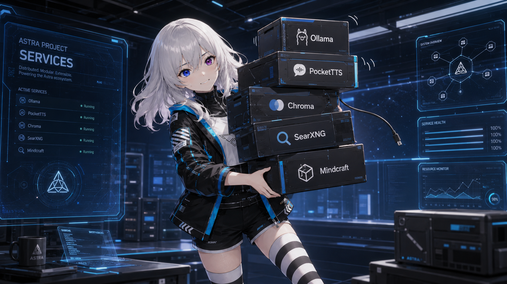

# Service catalog

Not everything listed here is a separate server. This catalog records the runtime dependencies you may need to install, start, configure, or preserve when moving Astra to another machine.

| Service | Role | Required? | Default connection or location |
| --- | --- | --- | --- |
| Ollama | Text, tool-routing, and multimodal inference | Yes for the current backend | `http://localhost:11434` |
| SQLite | Canonical chats, summaries, beliefs, memories, and metadata | Built in | Local database file managed by Astra |
| Chroma | Semantic and episodic retrieval indexes | Used by memory features | Local persistent store |
| Faster-Whisper | Speech-to-text | Only when `voice_input.path: stt` | In-process model |
| PocketTTS | Fast local speech synthesis with a baked voice state | Only when selected | In-process model and `.safetensors` voice |
| Piper | Alternative local speech synthesis | Optional | In-process model file |
| GPT-SoVITS | Alternative reference-voice synthesis | Optional | `http://127.0.0.1:9880/tts` |
| SearXNG | Search results for Astra's web integration | Optional | `http://localhost:8080` |
| Mindcraft fork | Minecraft bot and external action protocol | Optional, experimental | `http://localhost:8081` |

## Typical startup order

1. Start Ollama and ensure the configured model is available.
2. Start optional network services such as SearXNG, GPT-SoVITS, or Mindcraft.
3. Start Astra.
4. Open the browser UI and verify one plain text turn before testing media or tools.

Most optional integrations reconnect or fail independently, but starting them first makes startup logs easier to read.

<figure class="astra-site-illustration">
  
  <figcaption>Astra's extremely local toolbox. All services are reporting 100%, so naturally one cable is loose.</figcaption>
</figure>

## Runbooks

- [PocketTTS](pocket-tts.md) — install the engine, bake a voice, select it, and diagnose output.
- [Mindcraft integration](mindcraft.md) — install the project fork and connect Astra to a Minecraft world.

!!! note "Machine-local settings"
    Keep endpoints, model names, reference audio paths, ports, and personal profiles in `app/config/assistant.yaml` or the external service's local configuration. The committed template should remain a safe example.
